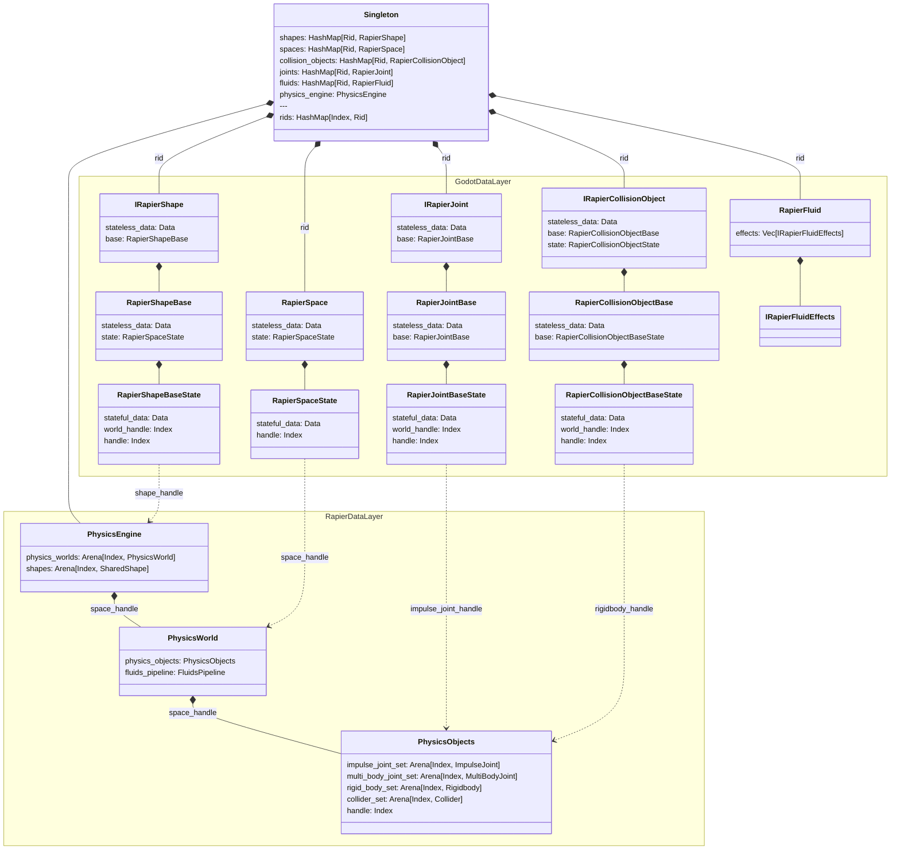

# Architecture

The Godot Rapier data is organized in two layers:
- Godot Data Layer: This maps to what Godot sends to the plugin.
- Rapier Data Layer: This is data converted from Godot to match Rapier Lib data.

This data is held in a **Singleton** for performance reasons.

