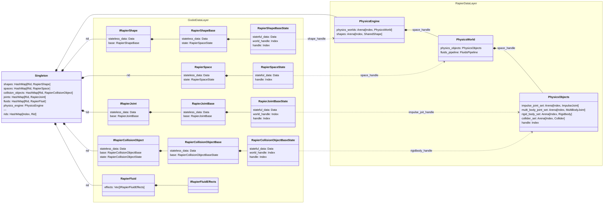
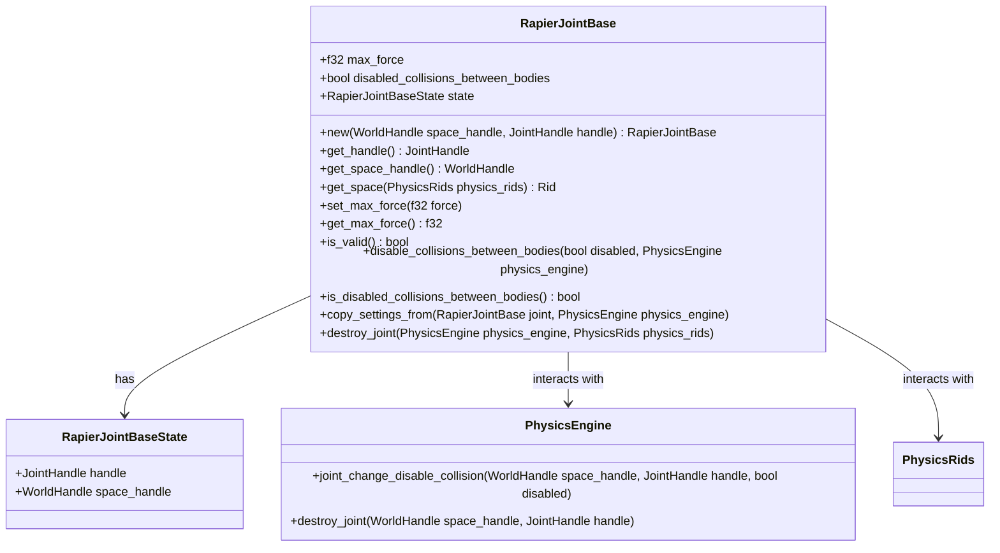

# Architecture

The Godot Rapier data is organized in two layers:
- Godot Data Layer: This maps to what Godot sends to the plugin.
- Rapier Data Layer: This is data converted from Godot to match Rapier Lib data.

This data is held in a **Singleton** for performance reasons.



## Spaces

Spaces hold some statelss data, and some data that holds state. The stateful data also holds an index to the **PhysicsWorld** it simulates. The physics world is located on the **Singleton**.

```mermaid
classDiagram
namespace Godot Data Layer {
}
RapierSpace *-- RapierSpaceState
PhysicsWorld <.. RapierSpaceState
```

## Joint

