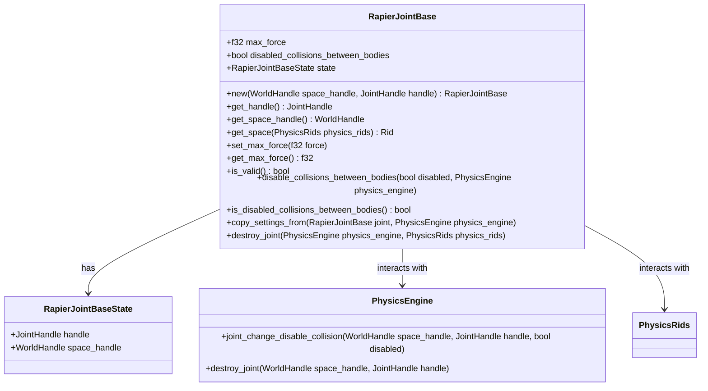

## Joint

```mermaid
classDiagram
    class RapierJointBase {
        +f32 max_force
        +bool disabled_collisions_between_bodies
        +RapierJointBaseState state
        +new(WorldHandle space_handle, JointHandle handle) RapierJointBase
        +get_handle() JointHandle
        +get_space_handle() WorldHandle
        +get_space(PhysicsRids physics_rids) Rid
        +set_max_force(f32 force)
        +get_max_force() f32
        +is_valid() bool
        +disable_collisions_between_bodies(bool disabled, PhysicsEngine physics_engine)
        +is_disabled_collisions_between_bodies() bool
        +copy_settings_from(RapierJointBase joint, PhysicsEngine physics_engine)
        +destroy_joint(PhysicsEngine physics_engine, PhysicsRids physics_rids)
    }

    class RapierJointBaseState {
        +JointHandle handle
        +WorldHandle space_handle
    }

    class PhysicsEngine {
        +joint_change_disable_collision(WorldHandle space_handle, JointHandle handle, bool disabled)
        +destroy_joint(WorldHandle space_handle, JointHandle handle)
    }

    class PhysicsRids {
    }

    RapierJointBase --> RapierJointBaseState : has
    RapierJointBase --> PhysicsEngine : interacts with
    RapierJointBase --> PhysicsRids : interacts with
```